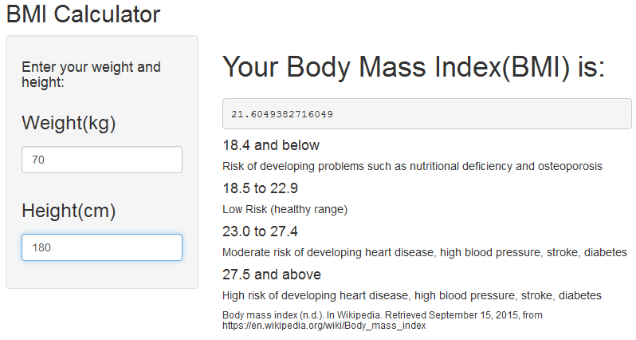

Body Mass Index Calculator
========================================================
author: Koh Tongyi
date: 19/9/2015

What is BMI?
========================================================

Body mass index (BMI) is a measure of body fat based on height and weight that applies to adult men and women. It is expressed in expressed in units of kg/m2. It is used to measure the amount of tissue mass (muscle, fat, and bone) in an individual, and then categorize the person health risk based on the value.

BMI cut off figures in Singapore
========================================================

| BMI range - kg/m2 | Health Risk                                                                      |
|-------------------|----------------------------------------------------------------------------------|
| 18.4 and below    | Risk of developing problems such as nutritional deficiency and osteoporosis      |
| 18.5 to 22.9      |                                                                                  |
| 23.0 to 27.4      | Moderate risk of developing heart disease, high blood pressure, stroke, diabetes |
| 27.5 and above    | High risk of developing heart disease, high blood pressure, stroke, diabetes     |

Source: Body mass index (n.d.). In Wikipedia. Retrieved September 15, 2015, from https://en.wikipedia.org/wiki/Body_mass_index

Instruction
========================================================

Enter your weight and height and see your BMI.

Links
========================================================

BMI Calculator

https://tongyikoh.shinyapps.io/BMICalculator

